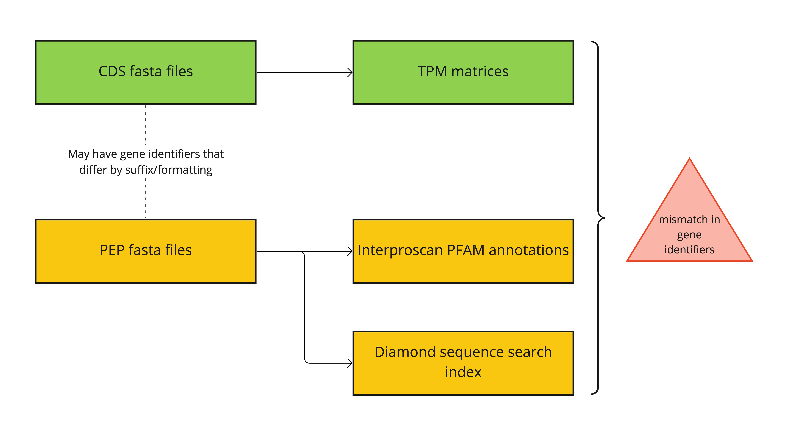
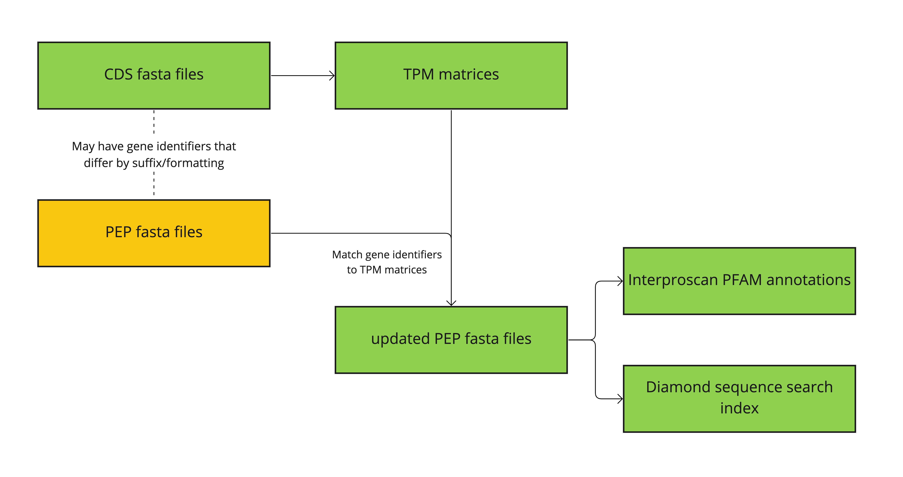

# Protein sequences

Protein sequences are written as PEP fasta files.


## Data source

PEP files were obtained by Erielle, with sources documented [here](). ==\# TODO: add link==


## Data processing

!!! info "Objective"

    We needed to preprocess input files involving gene entities, to ensure consistent gene identifiers used throughout the system.


!!! tip "TLDR"

    If you are too {--lazy--} {++busy++} to read, the processing can be summarized in this [Google Sheets](https://docs.google.com/spreadsheets/d/1PHXs9-TEwm1lnPXz05feVgAOzRzxlrKytoUKQWmpRPo/edit?usp=sharing){:target="_blank"}


### The problem

We found differences in identifiers in the CDS fasta files and in the PEP fasta files.

Mismatch problem:



Our data cleaning step:



As gene identifiers differ between the CDS/TPM file and the PEP file in unique and varied ways, two steps were taken for the cleaning.

1. Exploratory analysis to identify how the identifiers need to be parsed for the different species.

2. Assigning the parsing rules to each species files and generating new pep files with the identifiers modified (if neccessary) to match the identifiers in the CDS/TPM file.


### Exploratory analysis

Gene identifiers were extracted from both the **TPM matrices** and the **PEP files**. As the PEP files are in fasta format, the gene identifier was obtained from the first word after each `>`. The identifiers are expected to be standardised to uppercase.

An initial quick matching of gene identifiers was performed for each species. While this may not be the most precise comparison, it helps avoid `n x n` comparisons, while providing sufficient initial exploratory metrics. This narrows down the species which require more refined matching methods. This rough exploratory step is justified as there could be undefined variations in the ways gene identifiers differ for different species.

In this exploratory step, the identifiers from TPM and PEP sources were alphabetically sorted respectively. The array of identifiers from TPM was iterated as the point of reference, and comparison for each species was performed as such:

``` title="Logic for rough array comparison"
Iterate identifiers in TPM array
    Check if the current identifier in PEP array fulfill any of:
        - matches (`identical`)
        - TPM identifier is a subset of PEP identifier (`pep_longer`)
        - PEP identifier is a subset of TPM identifier (`pep_shorter`)
    If none, then this TPM identifier is deemed to have no match
        then move to the next identifier in PEP array
```

!!! danger "Implication"

    This means that if there is a TPM identifier that cannot be matched to any PEP identifier, then the matching for the remaning TPM identifier will not be performed anymore.

    This is planned for as we first want to filter out species that are easy to match. The remaning species falling under this trap can be further analysed in subsequent step as they would involve more computationally intensive comparisons.


### Initial exploratory stats

The exploratory statistics are summarised in this table, which can also be viewed in [Google Sheets](https://docs.google.com/spreadsheets/d/1PHXs9-TEwm1lnPXz05feVgAOzRzxlrKytoUKQWmpRPo/edit?usp=sharing){:target="_blank"}.

<iframe
    src="https://docs.google.com/spreadsheets/d/e/2PACX-1vTVt6BEK-BLHIDSEGTzJMZ97ZYEhBdwZjUZf6s-Jg_QMX_Xn4w2qZ-jT9xR8dWhrWbjtVHFGqa6HBA5/pubhtml?gid=6101554&amp;single=true&amp;widget=true&amp;headers=false"
    width="100%"
    height="600px"
>
</iframe>

**Columns**

- tpm_length: number of genes in TPM file
- pep_length: number of genes in PEP file
- identical: number of gene identifiers that are idnetical
- pep_longer: number of gene identifiers in TPM file which are a substring of that in PEP file
- pep_shorter: number of gene identifiers in PEP file which are a substring of that in TPM file
- pep_not_found: number of genes in TPM file, for which no matching identifier found in PEP file


**Row 1 - 44**

:   The rows has been manually rearranged. The top rows, where "HOW TO FIX" column has no value, it implies perfect matching of gene identifiers and they just need to be captialised in the PEP files.

**Row 45 - 59**

:   These species have fewer genes in the PEP file and all the genes in the PEP file have been mapped to an indentifier in the TPM matrices. So the TPM indentifiers can safely be known to be true "no match".

**Remaining rows**

The remaining rows were analysed individually. The examples and fixes are detailed in the Google Sheet too.


### Heuristic for replacing identifiers

These heuristics were used for preprocessing the gene identifiers.

- Gene identifiers are capitalised to standardise across our use-case.

- Check if identifiers in TPM matrix/CDS matches or is a subset of PEP's. If yes, then the identifier in PEP file is replaced.

- If TPM's identifier don't match any in PEP, then
    - The gene shall have no matching gene annotation for PFAM
    - The gene will not be searchable by protein sequence

- If PEP's identifier don't match any in TPM, then
    - The gene entry can be removed/ignored from the PEP file

- Sometimes, the PEP files comprises multiple isoforms. The symptoms of such cases would be when there are more gene identifiers in PEP file than in TPM file. (For most taxids, the number is higher for TPM file) To deal with this, we have to select the matching isoform, or if there is no perfect match in labels, then we can select any one isoform.

- In some cases the replacement gene identifiers are found within the header line of sequences. We have to manually parse this out for some species.


### Fasta relabeller source code

Utility class to relabel fasta sequence identifiers.

<script src="https://gist.github.com/wirriamm/93c973306f2d633c964cb7df29479427.js"></script>


### Parsers assigned for each species

Refer to the `jobs` array to see what parsers are exactly assigned to each species.

<script src="https://gist.github.com/wirriamm/d6db0b1a77c9984f60d9f0618c8ae04f.js"></script>


### Validation stats

We show that most of our PEP gene identifiers were mapped to a gene indentifier in TPM file. Looking at the % matched column shows a good matching of gene identifiers.

<iframe
    src="https://docs.google.com/spreadsheets/d/e/2PACX-1vTVt6BEK-BLHIDSEGTzJMZ97ZYEhBdwZjUZf6s-Jg_QMX_Xn4w2qZ-jT9xR8dWhrWbjtVHFGqa6HBA5/pubhtml?gid=222551301&amp;single=true&amp;widget=true&amp;headers=false"
    width="100%"
    height="600px"
>
</iframe>


## Data availability

The cleaned pep files are available [here]().
